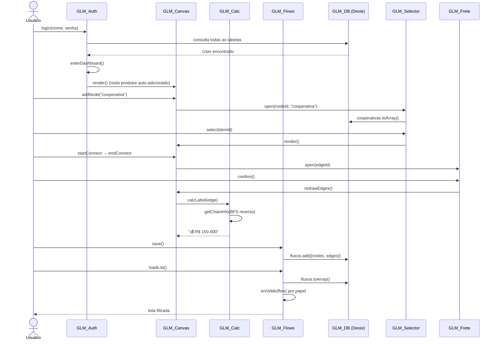

# GLM — Arquitetura de Software
## Gestão da Cadeia Agroindustrial · RS

Diagrama de classes do namespace `GLM` em `app.js`.  
Renderize com [Mermaid Live Editor](https://mermaid.live) ou qualquer visualizador Mermaid.

---

```mermaid
classDiagram
    direction TB

    %% ═══════════════════════════════════════════
    %% MÓDULO DE CONFIGURAÇÃO
    %% ═══════════════════════════════════════════

    class GLM_Config {
        <<module>>
        +NC : Object
        +ALLOW : Object
        +CULTURAS : string[]
        +MESES : string[]
        +TBLS : Object
        +NW : number = 276
        +HY : number = 30
    }

    note for GLM_Config "NC define label, cor, emoji e marcador\nde seta para cada tipo de nodo.\nALLOW define conexões válidas:\n  produtor → cooperativa | transportador\n  cooperativa → transportador | agro | expo\n  transportador → cooperativa | agro | expo"

    %% ═══════════════════════════════════════════
    %% ESTADO COMPARTILHADO
    %% ═══════════════════════════════════════════

    class AppState {
        <<shared variables>>
        +U : User
        +nodes : NodeObject[]
        +edges : EdgeObject[]
        +drag : string
        +dOff : Object
        +draft : Object
        +selNid : string
        +selType : string
        +selItems : Object[]
        +pendEid : string
        +crudType : string
        +crudEditId : number
        +regRole : string
        +nextN : number
        +nextE : number
    }

    note for AppState "Variáveis de módulo (closures).\nTodos os módulos leem/escrevem\ndiretamente nessas variáveis."

    %% ═══════════════════════════════════════════
    %% BANCO DE DADOS
    %% ═══════════════════════════════════════════

    class GLM_DB {
        <<module>>
        +db : Dexie
        +SEEDS : Object
        +init() Promise~void~
        +updateCounts() Promise~void~
    }

    note for GLM_DB "Tabelas Dexie:\n produtores, cooperativas,\n transportadores, agroindustrias,\n exportadoras, fluxos\nSeed automático com 12 entidades\nde cada tipo, todas do RS."

    %% ═══════════════════════════════════════════
    %% UTILITÁRIOS DE INTERFACE
    %% ═══════════════════════════════════════════

    class GLM_UI {
        <<module>>
        +g(id) HTMLElement
        +gv(id) string
        +toast(msg, type) void
        +openModal(id) void
        +closeModal(id) void
        +brl(v) string
        +fmtN(v) string
        +shErr(el, msg) void
        +hideErr(el) void
    }

    %% ═══════════════════════════════════════════
    %% AUTENTICAÇÃO
    %% ═══════════════════════════════════════════

    class GLM_Auth {
        <<module>>
        +showScreen(id) void
        +gotoRegister() void
        +gotoLogin() void
        +selectRole(el, role) void
        +buildRegFields() void
        +login() Promise~void~
        +register() Promise~void~
        +enterDashboard() void
        +logout() void
        +buildTabs() void
        +showTab(name) void
    }

    note for GLM_Auth "login() verifica credenciais em todas\nas tabelas de entidade + admin fixo.\nbuildTabs() gera abas conforme papel:\n  produtor → Canvas + Sugestões\n  transportador → Canvas + Dados + Agenda\n  cooperativa|agro|expo → Canvas + Dados\n  admin → Canvas + Dados Gerais"

    %% ═══════════════════════════════════════════
    %% CANVAS DE FLUXO
    %% ═══════════════════════════════════════════

    class GLM_Canvas {
        <<module>>
        +render() void
        +addNode(type) void
        +deleteNode(id) void
        +clearCanvas() void
        +redrawEdges() void
        +startDrag(nodeId, e) void
        +onMouseMove(e) void
        +onMouseUp() void
        +onMouseLeave() void
        +startConnect(nodeId, e) void
        +endConnect(toId, e) void
        +deleteEdge(eid) void
        -_renderNode(n) void
        -_renderBody(n) string
        -_getFields(type, data) Array
        -_renderEdge(e) void
        -_cancelDraft() void
    }

    note for GLM_Canvas "Renderiza nodos como divs absolutas\ne arestas como paths SVG bezier.\nDrag: mousedown no cabeçalho do nodo.\nConexão: mousedown no handle direito (nh-o)\n → arrastar → mouseup no handle esquerdo (nh-i).\nValida ALLOW antes de criar aresta."

    %% ═══════════════════════════════════════════
    %% MOTOR DE CÁLCULO
    %% ═══════════════════════════════════════════

    class GLM_Calc {
        <<module>>
        +getChainInfo(destId) ChainInfo
        +calcFinalRevenue(destId) string
        +calcLabel(edge) string
        +updateResults() void
    }

    note for GLM_Calc "BFS reverso a partir do destino:\n  1. Coleta prodNode, totalFrete,\n     cotação, coopDiscount, bonus\n  2. Fórmula:\n     receita = (cotação+bonus)×qtd\n              − max(0, frete − desc.)\n  3. Cotação: da Cooperativa se presente\n     na cadeia; do destino caso contrário"

    %% ═══════════════════════════════════════════
    %% SELETOR DE ENTIDADE
    %% ═══════════════════════════════════════════

    class GLM_Selector {
        <<module>>
        +open(nodeId, type) Promise~void~
        +filter() void
        +select(dbId) void
        -_getTag(type, item) string
    }

    note for GLM_Selector "Filtra cooperativas por cultura\nse o usuário logado é Produtor."

    %% ═══════════════════════════════════════════
    %% MODAL DE FRETE
    %% ═══════════════════════════════════════════

    class GLM_Frete {
        <<module>>
        +open(edgeId) void
        +calculate() void
        +confirm() void
    }

    note for GLM_Frete "Auto-detecta quantidade do Produtor\nconectado ao Transportador.\nCusto = qtd × preçoTon\nResultado salvo em edge.frete"

    %% ═══════════════════════════════════════════
    %% PAINEL CRUD
    %% ═══════════════════════════════════════════

    class GLM_CRUD {
        <<module>>
        +render() Promise~void~
        +openAdd(type) void
        +openEdit(type, id) Promise~void~
        +save() Promise~void~
        +delete(type, id) Promise~void~
        +saveDiscount() Promise~void~
        +saveBonus() Promise~void~
        -_buildTable(type, items) string
        -_buildForm(type, values) string
    }

    note for GLM_CRUD "Admin vê todas as tabelas.\nDemais usuários veem apenas a sua.\nCooperativa: campo de desconto de frete.\nAgroindústria: campo de bônus por tonelada."

    %% ═══════════════════════════════════════════
    %% PAINÉIS ESPECIALIZADOS
    %% ═══════════════════════════════════════════

    class GLM_Panels {
        <<module>>
        +renderSuggestions() Promise~void~
        +renderAgenda() Promise~void~
    }

    note for GLM_Panels "renderSuggestions(): rankeia destinos\npor receita estimada (sem frete),\nfiltrado pela cultura do Produtor.\n\nrenderAgenda(): itera sobre NODOS\n(não arestas!) para localizar o\nTransportador em fluxos salvos."

    %% ═══════════════════════════════════════════
    %% GESTÃO DE FLUXOS
    %% ═══════════════════════════════════════════

    class GLM_Flows {
        <<module>>
        +isVisible(flow) boolean
        +save() Promise~void~
        +loadList() Promise~void~
        +loadById(id) Promise~void~
    }

    note for GLM_Flows "Controle de acesso por papel:\n  admin → vê todos\n  produtor → seus fluxos OU onde aparece\n  coop|agro|expo|trans → SOMENTE fluxos\n    onde seu nodo (type+dbId) existe\nvalidação dupla: na listagem E no loadById"

    %% ═══════════════════════════════════════════
    %% TIPOS DE DADOS (estruturas)
    %% ═══════════════════════════════════════════

    class NodeObject {
        <<structure>>
        +id : string
        +type : string
        +x : number
        +y : number
        +dbData : Object
        +dbId : number
    }

    class EdgeObject {
        <<structure>>
        +id : string
        +from : string
        +to : string
        +frete : FreteData
    }

    class FreteData {
        <<structure>>
        +qtd : number
        +custo : number
        +label : string
    }

    class ChainInfo {
        <<structure>>
        +prodNode : NodeObject
        +totalFrete : number
        +cotacao : number
        +coopDiscount : number
        +bonus : number
    }

    class User {
        <<structure>>
        +id : number
        +nome : string
        +role : string
        +senha : string
        +cultura : string
        +cidade : string
        +estado : string
    }

    %% ═══════════════════════════════════════════
    %% PONTO DE ENTRADA
    %% ═══════════════════════════════════════════

    class Boot {
        <<entry point>>
        +wireEvents() void
        +GLM_DB.init()
    }

    note for Boot "wireEvents() centraliza TODOS os\nevent listeners — nenhum onclick=\nno HTML.\nUsa event delegation com data-*\npara elementos dinâmicos."

    %% ═══════════════════════════════════════════
    %% RELACIONAMENTOS
    %% ═══════════════════════════════════════════

    %% Boot inicializa tudo
    Boot --> GLM_DB        : init()
    Boot --> GLM_Auth      : via wireEvents
    Boot --> GLM_Canvas    : via wireEvents
    Boot --> GLM_Flows     : via wireEvents

    %% Auth usa DB e UI
    GLM_Auth --> GLM_DB    : login/register
    GLM_Auth --> GLM_UI    : toast, shErr
    GLM_Auth --> AppState  : lê/escreve U

    %% Canvas usa Calc, Selector, Frete e State
    GLM_Canvas --> GLM_Calc     : calcLabel, updateResults
    GLM_Canvas --> GLM_Selector : open (ao adicionar nodo)
    GLM_Canvas --> GLM_Frete    : open (ao criar aresta de frete)
    GLM_Canvas --> AppState     : lê/escreve nodes, edges, drag, draft
    GLM_Canvas --> GLM_Config   : NC, ALLOW, NW, HY

    %% Calc lê State e Config
    GLM_Calc --> AppState  : lê nodes, edges
    GLM_Calc --> GLM_Config: NC

    %% Selector usa DB e escreve State
    GLM_Selector --> GLM_DB    : toArray()
    GLM_Selector --> AppState  : selNid, selType, selItems
    GLM_Selector --> GLM_UI    : openModal, closeModal

    %% Frete lê/escreve State via edges
    GLM_Frete --> AppState  : lê edges, nodes; escreve edge.frete
    GLM_Frete --> GLM_UI    : openModal, closeModal

    %% CRUD usa DB, UI e State
    GLM_CRUD --> GLM_DB     : toArray, add, update, delete
    GLM_CRUD --> GLM_UI     : toast, openModal, closeModal
    GLM_CRUD --> AppState   : lê U, crudType, crudEditId
    GLM_CRUD --> GLM_Config : NC, TBLS, CULTURAS, MESES

    %% Panels usa DB e Calc
    GLM_Panels --> GLM_DB   : toArray (fluxos, cooperativas, etc.)
    GLM_Panels --> AppState : lê U
    GLM_Panels --> GLM_Config: NC, MESES

    %% Flows usa DB e valida com State
    GLM_Flows --> GLM_DB    : fluxos.add, get, orderBy
    GLM_Flows --> AppState  : lê U; escreve nodes, edges
    GLM_Flows --> GLM_UI    : toast, openModal, closeModal

    %% Tipos de dado
    AppState "1" o-- "0..*" NodeObject : nodes
    AppState "1" o-- "0..*" EdgeObject : edges
    AppState "1" o-- "0..1" User       : U
    EdgeObject o-- FreteData           : frete
    GLM_Calc ..> ChainInfo             : retorna
```

---

## Estrutura de Arquivos

```
agroflow/
├── index.html      — HTML puro (201 linhas): estrutura, sem lógica nem estilos inline
├── styles.css      — Folha de estilos completa (~280 linhas), tema claro
├── app.js          — Lógica completa (1.622 linhas), namespace GLM com JSDoc
├── ARCHITECTURE.md — Este arquivo (diagrama de classes Mermaid)
├── server.js       — Servidor Express para servir estaticamente
├── package.json    — Dependências npm
└── README.md       — Instruções de uso e deploy
```

## Fluxo de Dados Principal



## Regras de Negócio

| Regra | Onde implementada |
|---|---|
| Conexões válidas (Prod→Coop, etc.) | `GLM_Config.ALLOW` + `GLM_Canvas.endConnect()` |
| Cotação via Cooperativa ou Destino | `GLM_Calc.getChainInfo()` BFS reverso |
| Fórmula de receita | `GLM_Calc.calcFinalRevenue()` |
| Filtro de cooperativa por cultura | `GLM_Selector.open()` |
| Bônus de Agroindústria | `GLM_Calc.getChainInfo()` + `GLM_CRUD.saveBonus()` |
| Desconto de frete da Cooperativa | `GLM_Calc.getChainInfo()` + `GLM_CRUD.saveDiscount()` |
| Controle de acesso a fluxos | `GLM_Flows.isVisible()` |
| Agenda do Transportador por nodo | `GLM_Panels.renderAgenda()` |
