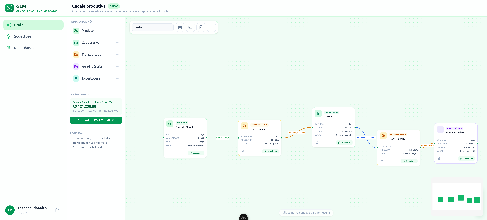

# 🌱 GLM — Grãos, Lavoura & Mercado

> Plataforma de otimização da cadeia produtiva agroindustrial por meio de grafos visuais.



---

## i) Identificação da Equipe

| Nome | Função |
|---|---|
| **Gabriel Azenha Fachim** | Gravador e Editor · Otimização de Rotas e Cálculo por Grafos |
| **Luiz Batista Cardoso** | Analista de Sistemas · Gerente de Banco de Dados · Geração de Dados Sintéticos · Apresentador |
| **Matheus Machado Faccin** | Desenvolvimento Backend · Marketing · Modelo de Negócio |
| **Mauricio Pereira Braga** | Desenvolvimento Frontend · Interface e Experiência do Usuário |
| **Mirkos Ortiz Marins** | Analista de Sistemas · Arquiteto de Projeto |

---

## ii) Escopo do Projeto

### Problema

O agronegócio brasileiro é um dos maiores do mundo, mas sua cadeia produtiva ainda opera com fragmentação de informação. Produtores rurais, cooperativas, transportadores, agroindústrias e exportadoras atuam em silos, onde cada um com seus próprios preços, prazos e condições. O produtor não tem visibilidade de **para quem vender**, **por qual preço**, **qual transportador contratar** e **qual a receita líquida real** de cada alternativa. O resultado é assimetria de informação e margens comprimidas.

### Solução

O **GLM** resolve esse problema com um **editor visual de fluxos baseado em grafos** (estilo n8n). O produtor monta a cadeia dele no canvas, conectando nós de produtor, cooperativa, transportador, agroindústria e exportadora — e o sistema calcula automaticamente a **receita líquida** de cada destino final, considerando:

- Cotação da cultura no destino
- Bônus por tonelada (agroindústria)
- Custo de frete (transportadores)
- Desconto de frete (cooperativas)
- Regras de conexão válida entre os elos da cadeia

Além disso, o sistema oferece **sugestões de melhores destinos** ranqueadas por receita estimada e uma **agenda de transportes** para transportadores visualizarem seus fluxos ativos.

### Relação com o Agronegócio

O GLM ataca o gargalo central da **comercialização agrícola** e da **logística de cargas**: conectar ponta a ponta a cadeia que começa na porteira da fazenda e termina no porto ou na indústria, dando ao produtor os dados necessários para tomar a decisão mais lucrativa.

---

## iii) Stack Tecnológica

### Frontend

| Tecnologia | Função |
|---|---|
| **Nuxt 4** (Vue 3 + Nitro) | Framework full-stack, SSR/SPA, estrutura de páginas e API |
| **Vue Flow** | Editor visual de nós e arestas (grafos interativos) |
| **Tailwind CSS 4** | Estilização utilitária, responsiva e consistente |
| **Lucide Icons** (via Nuxt Icon) | Conjunto de ícones para cada papel da cadeia |
| **VueUse** | Composables utilitários para Vue 3 |
| **TypeScript** | Tipagem estática em todo o código |

### Backend

| Tecnologia | Função |
|---|---|
| **Nitro** (server engine do Nuxt 4) | API RESTful com auto-import de rotas e HMR |
| **nuxt-auth-utils** | Autenticação por sessão com cookies |
| **Zod** | Validação de schemas de entrada nas APIs |
| **Drizzle ORM** | Mapeamento objeto-relacional type-safe |
| **PostgreSQL 16** | Banco de dados relacional |

### Infraestrutura

| Tecnologia | Função |
|---|---|
| **Docker + Compose** | Ambiente de desenvolvimento reproduzível |
| **Husky + lint-staged** | Git hooks para qualidade de código |
| **ESLint + Prettier** | Padronização de código |
| **Drizzle Kit** | Migrations e gerenciamento do schema |

---

## iv) Arquitetura

O GLM segue uma arquitetura **monorepo full-stack** no Nuxt 4, com três camotas bem definidas e tipos compartilhados entre cliente e servidor via alias `#shared`.

```
┌──────────────────────────────────────────────────────────────┐
│                 CLIENT (app/) — Vue 3 + Tailwind              │
│                                                              │
│  Pages: /login, /register, /app                              │
│  ├── app/index.vue       ← Editor de fluxo (Vue Flow)        │
│  ├── app/sugestoes.vue   ← Ranking de destinos               │
│  ├── app/agenda.vue      ← Agenda do transportador           │
│  └── app/meus-dados.vue  ← CRUD de dados do perfil           │
│                                                              │
│  Components:                                                 │
│  ├── flow/GlmFlowEditor   ← Canvas interativo                │
│  ├── flow/GlmNode         ← Renderização de cada nó          │
│  ├── GlmModal             ← Modal reutilizável               │
│  ├── GlmLogo              ← Identidade visual                │
│  └── PagePlaceholder      ← Placeholder de página vazia      │
│                                                              │
│  Composables: format.ts, roleStyle.ts                        │
│  Layouts: default, auth, dashboard                           │
│  Middleware: auth.ts, guest.ts                               │
└──────────┬───────────────────────────────────────────────────┘
           │ $fetch() — API calls
           ▼
┌──────────────────────────────────────────────────────────────┐
│               SERVER (server/) — Nitro API                   │
│                                                              │
│  API Endpoints:                                              │
│  ├── /api/auth/login.post    ─ Autenticação                  │
│  ├── /api/auth/register.post ─ Cadastro                      │
│  ├── /api/auth/logout.post   ─ Encerrar sessão               │
│  ├── /api/me.get             ─ Dados do usuário logado       │
│  ├── /api/fluxos/index.get   ─ Listar fluxos                 │
│  ├── /api/fluxos/index.post  ─ Salvar fluxo                  │
│  ├── /api/fluxos/[id].get    ─ Carregar fluxo                │
│  ├── /api/fluxos/[id].delete ─ Deletar fluxo                 │
│  ├── /api/participants/index.get  ─ Listar entidades         │
│  ├── /api/participants/index.post ─ Criar entidade           │
│  ├── /api/participants/[id].put   ─ Atualizar entidade       │
│  ├── /api/participants/[id].delete ─ Deletar entidade        │
│  ├── /api/sugestoes.get    ─ Ranking para o produtor         │
│  └── /api/agenda.get       ─ Agenda para transportador       │
│                                                              │
│  Utils: users, participants, fluxos, sugestoes, agenda,      │
│         schemas (Zod), ids (geração), seed-demo              │
│                                                              │
│  DB Layer: Drizzle ORM + PostgreSQL                          │
│  └── Schema: users, fluxos (nodes + edges em JSONB)          │
└──────────┬───────────────────────────────────────────────────┘
           │ drizzle-orm
           ▼
┌──────────────────────────────────────────────────────────────┐
│             DATABASE — PostgreSQL 16                         │
│                                                              │
│  Tabelas:                                                    │
│                                                              │
│  ┌────────────┐      ┌──────────────────┐                   │
│  │   users    │      │     fluxos       │                   │
│  │────────────│      │──────────────────│                   │
│  │ id (PK)    │      │ id (PK)          │                   │
│  │ name       │◄─────│ user_id (FK)     │                   │
│  │ email      │      │ nome             │                   │
│  │ tipo_usuario│     │ user_role        │                   │
│  │ cultura    │      │ nodes (JSONB)    │                   │
│  │ quantidade │      │ edges (JSONB)    │                   │
│  │ cotacao    │      │ created_at       │                   │
│  │ bonus      │      └──────────────────┘                   │
│  │ ...        │                                             │
│  └────────────┘                                             │
│                                                              │
│  6 papéis: PRODUTOR, COOPERATIVA, TRANSPORTADOR,             │
│            AGROINDUSTRIA, EXPORTADORA, ADMIN                 │
└──────────────────────────────────────────────────────────────┘
```

### Fluxo de Dados Principal

1. **Usuário faz login** → sessão criada no servidor via cookie
2. **Produtor entra no editor** → nó do próprio produtor auto-adicionado no canvas com seus dados (cultura, quantidade)
3. **Produtor adiciona nós** (cooperativa, transportador, agroindústria) e os vincula a entidades reais do banco via seletor filtrado por cultura
4. **Conecta os nós** arrastando arestas — o sistema valida conexões permitidas (`ALLOW`) e abre modal de frete quando necessário
5. **Cálculo automático** via BFS reverso: para cada destino final, percorre a cadeia de trás pra frente, soma fretes, aplica bônus e descontos, e exibe a **receita líquida** na aresta
6. **Salva o fluxo** como JSONB no banco, com controle de visibilidade por papel
7. **Produtor consulta Sugestões** → ranking de cooperativas, agroindústrias e exportadoras da mesma cultura, ordenado por cotação efetiva

### Regras de Negócio

| Regra | Implementação |
|---|---|
| Conexões válidas | `ALLOW` em `shared/domain.ts`: produtor → cooperativa/transportador; cooperativa → transportador/agroindústria/exportadora; transportador → cooperativa/agroindústria/exportadora |
| Cálculo de receita | `chain.ts`: `receita = (cotação + bônus) × qtd − max(0, freteTotal − descontoCoop)` |
| Cotação via cooperativa | BFS reverso: se cooperativa presente na cadeia, usa cotação dela; senão, usa cotação do destino |
| Bônus de agroindústria | `getChainInfo()` coleta `bonus` do nó de destino |
| Seletor filtrado | Produtor vê apenas cooperativas da mesma cultura que ele produz |
| Visibilidade de fluxos | Admin vê todos; produtor vê seus fluxos ou onde aparece como nó; demais papéis vêem apenas fluxos com seu próprio nó |

---

## v) Situação do Projeto

### Arquitetura Original vs. Implementação Atual

O projeto partiu de um esboço documentado em [`ARCHITECTURE.md`](./ARCHITECTURE.md) que descrevia uma aplicação **JavaScript puro** com IndexedDB (Dexie), servidor Express estático, canvas SVG customizado e CSS puro. A implementação evoluíu significativamente:

| Aspecto | Projetado (ARCHITECTURE.md) | Implementado |
|---|---|---|
| Framework | Vanilla JS (app.js, 1.622 linhas) | **Nuxt 4** (Vue 3 + Nitro) |
| Banco de dados | **Dexie/IndexedDB** (client-side) | **PostgreSQL 16** (servidor) |
| ORM | Nenhum | **Drizzle ORM** com migrations |
| Canvas | SVG custom (mousedown/mouseup, paths bezier) | **Vue Flow** (biblioteca consolidada) |
| Autenticação | Login local (varre todas as tabelas Dexie) | **nuxt-auth-utils** (sessão criptografada) |
| Estilo | CSS puro (~280 linhas) | **Tailwind CSS 4** |
| API | Servidor Express para arquivos estáticos | **Nitro** auto-importado com 10+ endpoints REST |
| Tipagem | JSDoc nos módulos | **TypeScript** full-stack |
| Validação | Validação manual | **Zod** schemas |
| Qualidade | Nenhuma | ESLint + Prettier + Husky + lint-staged |

### Requisitos Planejados vs. Implementados

| Requisito | Status |
|---|---|
| Cadastro e autenticação de usuários por papel | ✅ Implementado |
| Editor visual de fluxo (canvas) com nós e arestas | ✅ Implementado (Vue Flow) |
| Regras de conexão válida entre papéis | ✅ Implementado (`ALLOW` + validação no canvas) |
| Vinculação de nós a entidades reais do banco | ✅ Implementado (seletor modal) |
| Cálculo de frete entre transportador e parceiros | ✅ Implementado (modal de frete com auto-quantidade) |
| Cálculo de receita líquida por destino | ✅ Implementado (BFS reverso em `chain.ts`) |
| Ranking de sugestões para o produtor | ✅ Implementado (página `/app/sugestoes`) |
| Agenda de transportes para transportador | ✅ Implementado (página `/app/agenda`) |
| CRUD de dados do perfil do usuário | ✅ Implementado (página `/app/meus-dados`) |
| Persistência e carregamento de fluxos | ✅ Implementado (JSONB + controle de visibilidade) |
| Seed automático de dados de exemplo | ✅ Implementado (15 participantes do RS) |
| Migração para banco relacional | ✅ Concluído (Drizzle → PostgreSQL) |
| Infraestrutura Docker | ✅ Implementado (Dockerfile + docker-compose) |
| Integração com dados reais de mercado | 🔄 Futuro (cotações em tempo real) |
| Algoritmo de grafos ponderados (rota ótima entre múltiplos nós) | 🔄 Futuro (atualmente BFS linear) |
| Notificações e alertas | ❌ Pendente |
| Dashboard analítico com gráficos | ❌ Pendente |

---

## Como Rodar

```bash
cp .env.example .env
# gere a senha de sessão:
openssl rand -base64 32  # cole o valor em NUXT_SESSION_PASSWORD

docker compose up -d
docker exec glm-app npm run db:migrate
```

Acesse **http://localhost:3000** — login com `planalto@glm.app` / `glm12345`.

---

Feito para o campo 🌱 · Equipe **OVERCLOCK**
